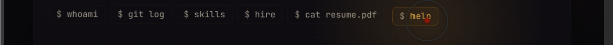
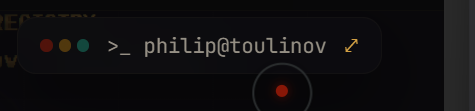
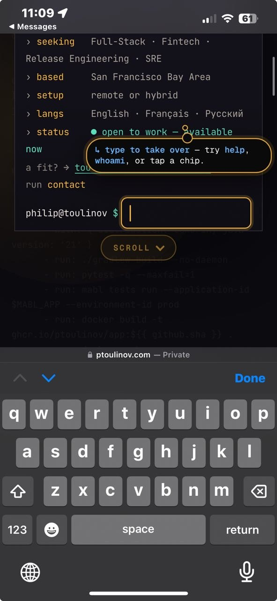
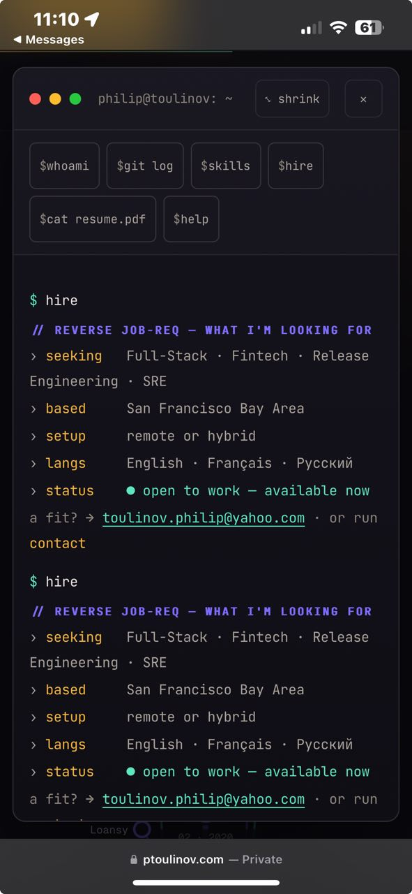
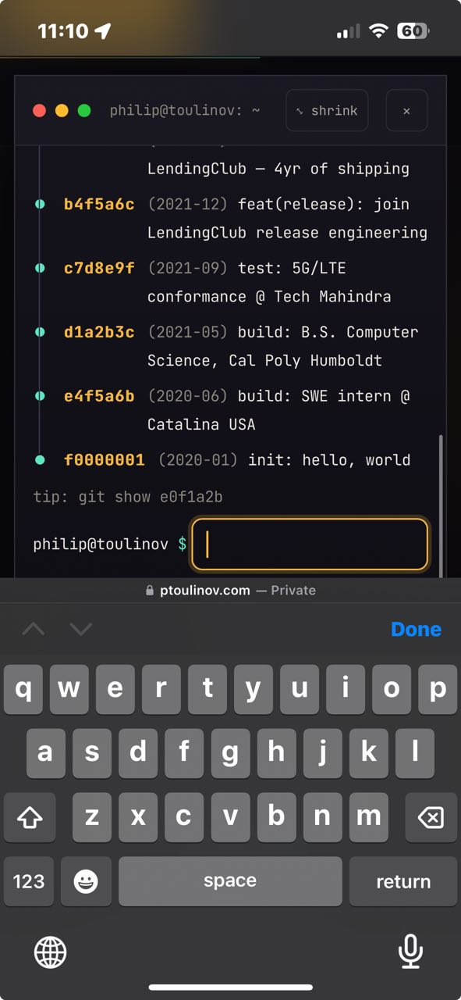

# Terminal Fix — Enhanced Prompt (with screenshot references)

> **Project:** `C:\Users\ptoul\Downloads\philip-toulinov-portfolio` (the `ptoulinov.com` interactive portfolio).
> **Stack:** hand-built static site. Markup in `index.html`, behavior in `scripts/main.js`, styles in `styles/main.css`. Additive content-hash + minify build via `npm run build` (outputs to `dist/`). Local dev server: `npm run serve` (port 8099).
> **Environment rule:** Windows. Use Windows commands or PowerShell only (never Bash/Git Bash).
> **Screenshots referenced below live in:** `docs/terminal-fix/screenshots/`

---

## Context

The hero is a "working terminal." Visitors can run commands by clicking **chips** (`whoami`, `git log`, `skills`, `hire`, `cat resume.pdf`, `help`) or typing into the input. The terminal can be **minimised** into a small floating pill and **re-expanded**. On mobile the soft keyboard changes the viewport and there are coach-mark hints. Four distinct bugs need fixing, all verified live with Playwright (mobile viewport).

---

## Issue 1 — Chip buttons don't run their command (they just scroll the page down)

**Screenshot:** `docs/terminal-fix/screenshots/issue1-chip-buttons.png`

The chip row (`$ whoami`, `$ git log`, `$ skills`, `$ hire`, `$ cat resume.pdf`, `$ help`) shown in the image should **execute the corresponding terminal command** (same code path as typing the command and pressing Enter), printing the command's output into the terminal body. **Currently clicking/tapping a chip just scrolls the page downward** instead of running the command.

**Expected:** Clicking `whoami` runs `whoami` and renders its output in the terminal; same for every chip. No page scroll side-effect. Markup lives at `index.html` `.term-chips#heroTermChips` buttons with `data-cmd="..."`. The runner appears to be exposed as `window.__heroRun(cmd)` (see the inline delegation at the bottom of `index.html` for `.tui-item[data-cmd]`); make the hero chips use that same runner.

**Acceptance:** With Playwright on a mobile viewport, tap each chip and assert (a) terminal output text for that command appears, and (b) `window.scrollY` did not jump to the next section.

---

## Issue 2 — Collapsed/minimised terminal must obey the same rules as the home terminal

**Screenshot:** `docs/terminal-fix/screenshots/issue2-collapsed-terminal-pill.png`

When minimised, the terminal becomes the floating pill shown (`>_ philip@toulinov ↗`). The collapsed/floating terminal must follow the **same behavioral rules as the inline home terminal** — i.e. running commands, chip behavior, input handling, auto-scroll-to-bottom of output, and focus behavior should be consistent between the two states. Right now the collapsed terminal diverges from the home terminal's rules.

**Acceptance:** Define the shared rules explicitly, then assert via Playwright that the same command produces the same output/scroll/focus behavior in both the inline and collapsed/floating states.

---

## Issue 3 — Don't trigger the home → experience/builds auto-scroll when a mobile user is using the terminal

**Screenshot:** `docs/terminal-fix/screenshots/issue3-mobile-keyboard-coachmark.png`

On phone, when the user focuses/types in the terminal (keyboard open, coach-mark "type to take over — try help, whoami, or tap a chip" visible), the page **must not auto-scroll from the hero/home down to the experience/builds section.** It currently does this, yanking the user away while they interact with the terminal.

**Acceptance:** On a mobile viewport with the input focused (keyboard shown), assert the scroll-cue / section auto-advance does **not** fire. Auto-scroll should be suppressed while the terminal has focus / is being interacted with on mobile.

---

## Issue 4 — Re-opening the minimised terminal must auto-scroll its body to the bottom

**Bug screenshot (current, wrong):** `docs/terminal-fix/screenshots/issue4-reopen-shows-top-BUG.png`

**Target screenshot (desired):** `docs/terminal-fix/screenshots/issue4-target-scrolled-to-bottom.png`

When the user re-opens (expands) the minimised terminal, it currently shows the **top** of the output / chip area (BUG image: the `$hire` reverse-job-req block from the top). Instead, on expand it should **auto-scroll the terminal body to the bottom**, where the latest output and the live input prompt are (TARGET image: `git log` history ending in `f0000001 init: hello, world`, `tip: git show ...`, and the focused `philip@toulinov $` input at the bottom). This behavior is observed/required on phone.

**Acceptance:** On a mobile viewport: run a command that produces long output, minimise, then expand — assert the terminal scroll container is at (or near) `scrollHeight` and the input prompt is visible, not the top.

---

## Process requirements

1. **Make a `/plan`** covering all four issues before editing, then execute it.
2. Identify the shared terminal rules (Issue 2) and centralize them so inline + collapsed states cannot drift.
3. **Verify everything live and locally with Playwright** (`npm run serve`, mobile viewport ~ iPhone). Capture before/after screenshots into `docs/terminal-fix/screenshots/` for each fix.
4. Use any helpful skill (e.g. `webapp-testing`, `flutter`/web review, `systematic-debugging`).
5. Run the existing test suites (`npm run test`, `test:interaction`, `test:console`) and keep them green.
6. Rebuild (`npm run build`) so `dist/` reflects the fixes.
7. Commit as you go with focused messages.
